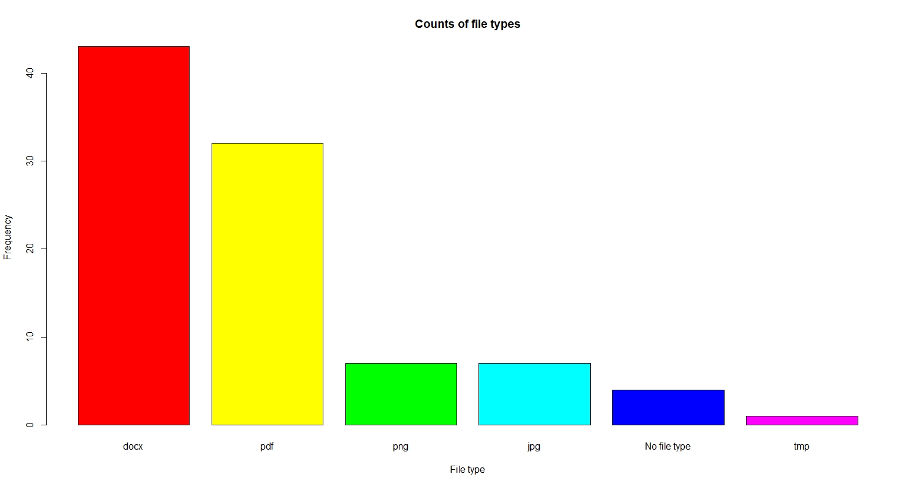

# File Statistics Visualizer
This project visualizes and displays several statistics about the types of files inside a given
directory.

A bar chart and pie chart are created to show the relative popularity of each file type.

As an added bonus, this project also includes an extra function for printing out every single file
and subdirectory within a user-inputted directory.

## Running Unit Tests

1. Install the `testthat` package.

2. In the R console of the root directory of this repository, enter `testthat::test_dir(here())` to
   run the unit tests.

## Third-Party Software

- [testthat](https://testthat.r-lib.org/) (MIT license): Unit testing framework.

- [dplyr](https://dplyr.tidyverse.org/) (MIT license): Data manipulation library.

- [stringr](https://stringr.tidyverse.org/) (MIT license): String manipulation library.
