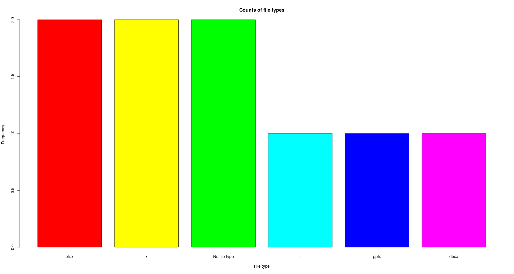

# LWRFileStatisticsVisualizer

[](https://opensource.org/licenses/MIT)


This project visualizes several statistics about the types of files inside a given directory; a bar
chart and pie chart are created to show the relative popularity of each file type.


As a bonus, this project also includes an extra program, `print-directory`, for printing out every
single file and subdirectory within a specific directory.


## Installation

Clone this repository onto your local machine:
```bash
git clone https://github.com/leeway64/LWRFileStatisticsVisualizer.git
cd LWRFileStatisticsVisualizer
R
renv::restore()
```

The `renv::restore()` command will install the required R libraries.

`renv` stands for reproducible environments. To learn more about `renv`, refer to
[their website](https://rstudio.github.io/renv/articles/renv.html), or run the following instructions
to create a PDF, out of `LaTeX`, of the short instructions I have created.

```bash
how-to-use-renv.tex
```


## LWRFileStatisticsVisualizer Example

After running the following commands:
```
R
source("bin/run-LWRFileStatisticsVisualizer.R")
Directory or file name: test
```

You should see the following two graphics:




The root directory of LWRFileStatisticsVisualizer is the root directory of the
LWRFileStatisticsVisualizer project.

Note that, after you enter the R Console by running the `R` command, you should see a message
saying something to the effect of `Project 'path/to/LWRFileStatisticsVisualizer' loaded. [renv 0.16.0]`.


## print-directory Example

Run the following commands directly in the terminal:

```bash
Rscript bin/run-print-directory.R 
Directory or file name: test/test-directory-1
test-directory-1 
    Subdir1 
        New Microsoft PowerPoint Presentation.pptx 
    Subdir2 
        New Microsoft Excel Worksheet.xlsx 
        SubdirA 
            New Microsoft Word Document.docx 
    test1.txt 
    test2.txt
```

Alternatively, you may also run the aforementioned scripts in RStudio; the
[`LWRFileStatisticsVisualizer.Rproj`](LWRFileStatisticsVisualizer.Rproj) file has been provided for
this purpose.


## Running Unit Tests

```bash
R
testthat::test_dir(here::here("test"))
```

Ensure you enter the R Console before running the `testthat::test_dir` command.


## Third-Party Software

- [testthat](https://testthat.r-lib.org/) (MIT license): Unit testing framework.
- [here](https://here.r-lib.org/) (MIT License): Library for making file referencing easier.
- [renv](https://rstudio.github.io/renv/) (MIT License): Reproducible environment creation library;
let's your create environments similar to Python virtual environments.
- [dplyr](https://dplyr.tidyverse.org/) (MIT license): Data manipulation library.
- [stringr](https://stringr.tidyverse.org/) (MIT license): String manipulation library.
- [box](https://klmr.me/box/) (MIT License): Package to increase modularity of R code.
